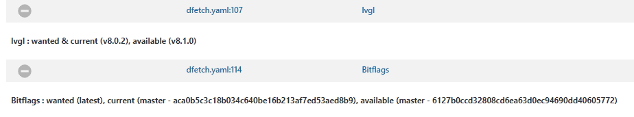
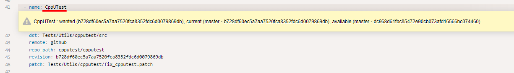
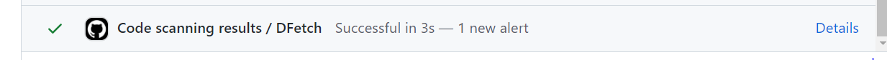
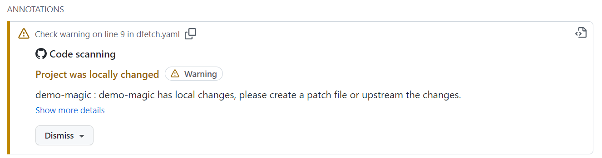
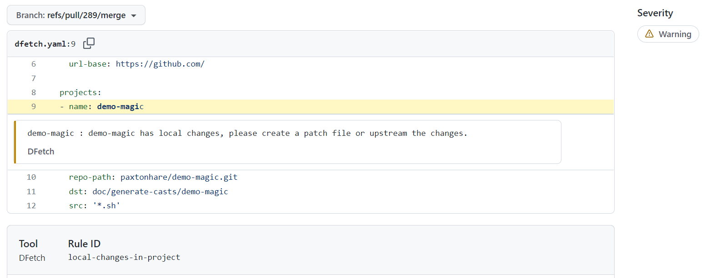
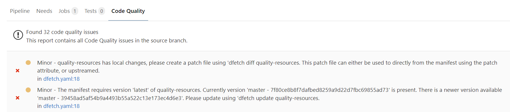
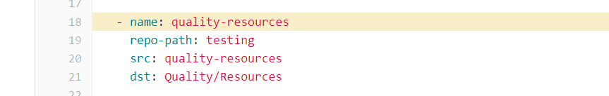

.. _check-ci:

Check projects in CI
====================

``dfetch check`` exits non-zero when any project is out-of-date or has local
changes, making it a natural pipeline gate.  Each supported CI system has its
own report format so findings surface natively inside the platform's UI.

- :ref:`check-ci-run` — run ``dfetch check`` as a pipeline step
- :ref:`check-ci-jenkins` — surface results in the Jenkins warnings-ng plugin
- :ref:`check-ci-github` — upload SARIF results to GitHub code scanning
- :ref:`check-ci-gitlab` — publish code-quality reports in GitLab merge requests

.. _check-ci-run:

Running dfetch check in CI
---------------------------

.. automodule:: dfetch.reporting.check.reporter

.. asciinema:: ../asciicasts/check-ci.cast

Without extra flags the results are printed to stdout and the build fails if
any issue is found:

.. code-block:: console

    $ dfetch check

Pass a ``--*-json`` flag to write a machine-readable report *and* continue
collecting results before deciding the build outcome (each section below shows
the exact flag).

.. _check-ci-jenkins:

Jenkins (warnings-ng)
---------------------

*Dfetch* writes a report in the `warnings-ng native JSON format`_ that the
`warnings-ng plugin`_ can ingest directly.

.. asciinema:: ../asciicasts/check.cast

**Severity mapping**

+-------------------+----------+-----------------------------------------------------+
| Dfetch result     | Severity | Meaning                                             |
+===================+==========+=====================================================+
| unfetched         | high     | Project was never fetched                           |
+-------------------+----------+-----------------------------------------------------+
| out-of-date       | normal   | A newer version is available                        |
+-------------------+----------+-----------------------------------------------------+
| pinned-out-of-date| low      | Pinned to a specific version; newer version exists  |
+-------------------+----------+-----------------------------------------------------+

Jenkins will show an overview of all issues:

Clicking an issue navigates to the exact line in the manifest:

**Pipeline snippet**

.. code-block:: groovy

    /* Linux agent */
    sh 'dfetch check --jenkins-json jenkins.json'

    /* Windows agent */
    bat 'dfetch check --jenkins-json jenkins.json'

    recordIssues tool: issues(pattern: 'jenkins.json', name: 'DFetch')

Use `quality gate configuration`_ in the warnings-ng plugin to control when
the build fails — for example, allow pinned-out-of-date without failing.

.. scenario-include:: ../features/check-report-jenkins.feature

.. _`warnings-ng plugin`: https://plugins.jenkins.io/warnings-ng/
.. _`warnings-ng native JSON format`: https://github.com/jenkinsci/warnings-ng-plugin/blob/master/doc/Documentation.md#export-your-issues-into-a-supported-format
.. _`quality gate configuration`: https://github.com/jenkinsci/warnings-ng-plugin/blob/master/doc/Documentation.md#quality-gate-configuration

.. _check-ci-github:

GitHub Actions (SARIF)
-----------------------

*Dfetch* can upload results to GitHub code scanning as a SARIF report, so
findings appear inline in pull requests.

**Severity mapping**

+-------------------+-----------+-----------------------------------------------------+
| Dfetch result     | Severity  | Meaning                                             |
+===================+===========+=====================================================+
| unfetched         | Error     | Project was never fetched                           |
+-------------------+-----------+-----------------------------------------------------+
| out-of-date       | Warning   | A newer version is available                        |
+-------------------+-----------+-----------------------------------------------------+
| pinned-out-of-date| Note      | Pinned; newer version exists                        |
+-------------------+-----------+-----------------------------------------------------+

Results appear on the Actions summary:

A locally changed project surfaces like this:

Clicking *details* brings you to the manifest entry:

**GitHub Actions workflow**

The easiest integration is the official action, which runs ``dfetch check``
and uploads the SARIF report in one step:

.. code-block:: yaml

    name: DFetch

    on: push

    permissions:
      contents: read

    jobs:
      dfetch:
        runs-on: ubuntu-latest

        permissions:
          contents: read
          security-events: write

        steps:
          - name: Dfetch SARIF Check
            uses: dfetch-org/dfetch@main
            with:
              working-directory: '.'

To run *Dfetch* yourself and control the output path:

.. code-block:: yaml

    - run: dfetch check --sarif dfetch.sarif
    - uses: github/codeql-action/upload-sarif@v3
      with:
        sarif_file: dfetch.sarif

For more information see the `GitHub SARIF documentation`_.

.. scenario-include:: ../features/check-report-sarif.feature

.. _`GitHub SARIF documentation`: https://docs.github.com/en/code-security/code-scanning/integrating-with-code-scanning

.. _check-ci-gitlab:

GitLab CI (Code Climate)
-------------------------

*Dfetch* writes a `Code Climate JSON`_ report that GitLab shows inline in
merge requests, comparing issues between the feature branch and the base
branch.

**Severity mapping**

+-------------------+----------+-----------------------------------------------------+
| Dfetch result     | Severity | Meaning                                             |
+===================+==========+=====================================================+
| unfetched         | major    | Project was never fetched                           |
+-------------------+----------+-----------------------------------------------------+
| out-of-date       | minor    | A newer version is available                        |
+-------------------+----------+-----------------------------------------------------+
| pinned-out-of-date| info     | Pinned; newer version exists                        |
+-------------------+----------+-----------------------------------------------------+

GitLab shows the results on the pipeline page:

Clicking an issue navigates to the manifest:

**``.gitlab-ci.yml`` snippet**

.. code-block:: yaml

    dfetch:
      image: "python:3.13"
      script:
        - pip install dfetch
        - dfetch check --code-climate dfetch.json
      artifacts:
        reports:
          codequality: dfetch.json

See `GitLab code quality reports`_ for more information.

.. scenario-include:: ../features/check-report-code-climate.feature

.. _`Code Climate JSON`: https://github.com/codeclimate/platform/blob/master/spec/analyzers/SPEC.md#data-types
.. _`GitLab code quality reports`: https://docs.gitlab.com/ee/ci/yaml/artifacts_reports.html#artifactsreportscodequality
