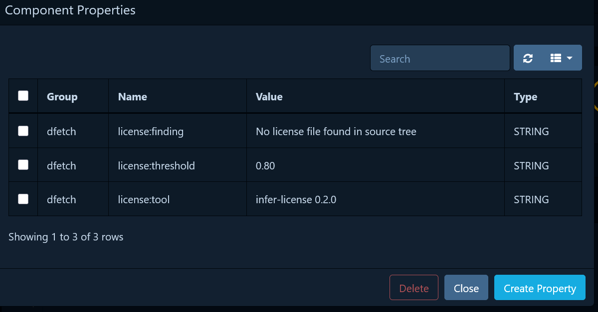
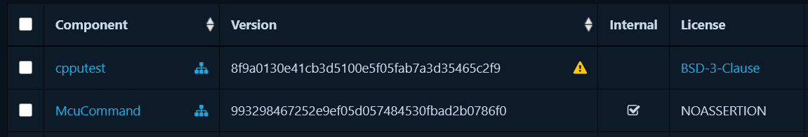
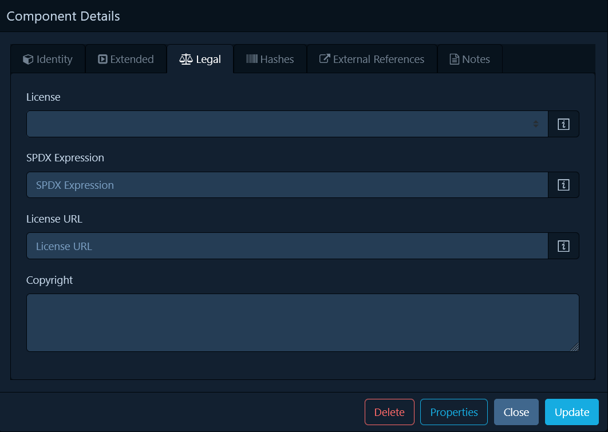

.. _sbom:

Generate an SBOM
================

``dfetch report`` generates a `CycloneDX`_ SBOM listing every vendored
dependency with its URL, revision, and auto-detected license.  Downstream
tools can use the SBOM to monitor for known vulnerabilities or enforce a
license policy across an organisation.

.. asciinema:: ../asciicasts/sbom.cast

.. code-block:: console

    $ dfetch report -t sbom -o dfetch.cdx.json

*Dfetch* parses each project's license at report time and can recognise common
license files with high accuracy.  For fetched projects, the ``licenses`` field is always populated:

* **Identified** — the SPDX identifier is recorded (e.g. ``MIT``, ``Apache-2.0``).
* **File found, unclassifiable** — a license-like file (``LICENSE``,
  ``COPYING``, …) was detected but its text could not be matched to a known
  SPDX identifier with sufficient confidence.  The field is set to
  ``NOASSERTION`` with ``acknowledgement`` set to ``concluded``, ``text``
  containing a human-readable explanation, and ``dfetch:license:noassertion:reason``
  set to ``UNCLASSIFIABLE_LICENSE_TEXT``.
* **No license file present** — no license-like file was found.  The field is
  set to ``NOASSERTION`` with ``acknowledgement`` set to ``concluded``, ``text``
  containing a human-readable explanation, and ``dfetch:license:noassertion:reason``
  set to ``NO_LICENSE_FILE``.

This ensures the ``licenses`` field is never silently omitted for scanned projects
and gives downstream compliance tooling actionable context regardless of the detection
outcome.  Note that projects that have never been fetched are not scanned and therefore
will not have license assertions in the SBOM output.

.. scenario-include:: ../features/report-sbom-license.feature
   :scenario: A fetched archive with an unclassifiable license file gets NOASSERTION

.. scenario-include:: ../features/report-sbom-license.feature
   :scenario: A fetched archive with no license file gets NOASSERTION

License detection auditability
~~~~~~~~~~~~~~~~~~~~~~~~~~~~~~~

For every scanned component *dfetch* records properties that allow
auditors to reproduce or re-evaluate license detection results:

``dfetch:license:<spdx-id>:confidence``
    The probability score (0-1) returned by *infer-license* for each
    successfully identified license.  Helps reviewers judge the detection
    reliability at a glance.

``dfetch:license:threshold``
    The minimum confidence required to accept an inference (``0.80`` by
    default).  If the threshold is raised or lowered in the future, auditors
    can compare stored scores against the new threshold without re-running
    dfetch.

``dfetch:license:tool``
    The *infer-license* library version used during the scan.  Different
    library versions may classify the same text differently; recording the
    version enables reproducible re-evaluation.

For components with ``NOASSERTION`` licenses, additional properties provide
machine-readable reasons:

``dfetch:license:noassertion:reason``
    An enum-style value indicating the specific reason for NOASSERTION:
    ``NO_LICENSE_FILE`` (no license file found) or
    ``UNCLASSIFIABLE_LICENSE_TEXT`` (license file present but unclassifiable).

Archive dependencies (``tar.gz``, ``zip``, …) are recorded with a
``distribution`` external reference.  When an ``integrity.hash:`` field is set
in the manifest the SBOM includes a ``SHA-256`` component hash for
supply-chain integrity verification.

.. scenario-include:: ../features/report-sbom.feature
   :scenario: A fetched project generates a json sbom

.. scenario-include:: ../features/report-sbom-archive.feature
   :scenario: A fetched archive without a hash generates a json sbom

.. scenario-include:: ../features/report-sbom-archive.feature
   :scenario: A fetched archive with sha256 hash generates a json sbom with hash

Viewing SBOM in DependencyTrack
-------------------------------

`DependencyTrack`_ is a popular open-source SBOM analysis platform that can ingest CycloneDX SBOMs generated by dfetch.

When viewing components with NOASSERTION licenses, the license field shows ``NOASSERTION``, and the properties panel
displays the dfetch license detection metadata. The license detail view remains empty, but the ``acknowledgement`` and
``text`` fields provide human-readable explanations, while the ``dfetch:license:noassertion:reason`` property enables
machine-readable filtering and automation.

NOASSERTION is an SPDX value used when no license information can be asserted for a component.

According to the `SPDX specification`_, ``NOASSERTION`` should be used if:

- the SPDX creator has attempted to but cannot reach a reasonable objective determination;
- the SPDX creator has made no attempt to determine this field; or
- the SPDX creator has intentionally provided no information.

In dfetch, ``NOASSERTION`` is set when license detection fails or no license files are found, ensuring
the licenses field is never silently omitted.

.. _`DependencyTrack`: https://dependencytrack.org/
.. _`SPDX specification`: https://spdx.github.io/spdx-spec/v3.0.1/model/Core/Individuals/NoAssertionElement/

GitLab
------

Upload the SBOM as a CycloneDX artifact so GitLab surfaces it in the
dependency scanning dashboard.  See `GitLab dependency scanning`_ for details.

.. code-block:: yaml

    dfetch:
      image: "python:3.13"
      script:
        - pip install dfetch
        - dfetch report -t sbom -o dfetch.cdx.json
      artifacts:
        reports:
          cyclonedx:
            - dfetch.cdx.json

GitHub Actions
--------------

Generate and upload the SBOM as a workflow artifact.  See `GitHub dependency
submission`_ for details.

.. code-block:: yaml

    jobs:
      SBOM-generation:
        runs-on: ubuntu-latest
        steps:
          - uses: actions/checkout@v5
          - uses: actions/setup-python@v6
            with:
              python-version: '3.13'
          - name: Generate SBOM
            run: pip install dfetch && dfetch report -t sbom -o dfetch.cdx.json
          - uses: actions/upload-artifact@v4
            with:
              name: sbom
              path: dfetch.cdx.json

.. _`CycloneDX`: https://cyclonedx.org/use-cases/
.. _`GitLab dependency scanning`: https://docs.gitlab.com/user/application_security/dependency_scanning/dependency_scanning_sbom/#cyclonedx-software-bill-of-materials
.. _`GitHub dependency submission`: https://docs.github.com/en/code-security/supply-chain-security/understanding-your-software-supply-chain/using-the-dependency-submission-api
