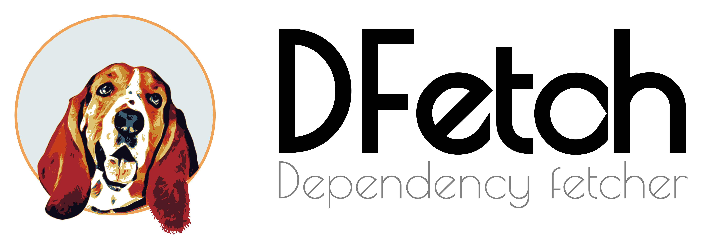

.. Dfetch documentation master file

:sd_hide_title:

.. meta::
   :description: Dfetch vendors source code from Git and SVN repositories directly into your project. No submodules, no lock-in, fully self-contained.
   :keywords: dfetch, dependency management, vendoring, git, svn, embedded development, source-only dependencies, multi-repo, supply chain, sbom, license compliance
   :author: Dfetch Contributors
   :google-site-verification: rXUIdonVCg6XtZUDdOd7fJdSNj3bOoJJRqCFn3OVb04

.. raw:: html

   <meta property="og:title" content="Dfetch — Vendor dependencies without the pain">
   <meta property="og:description" content="VCS-agnostic source-only dependency management. Works with Git and SVN. No submodules, no lock-in, supply-chain ready.">
   <meta property="og:image" content="https://dfetch.rtfd.io/static/dfetch-logo.png">
   <meta property="og:url" content="https://dfetch-org.github.io">

   <meta name="twitter:card" content="summary_large_image">
   <meta name="twitter:title" content="Dfetch — Vendor dependencies without the pain">
   <meta name="twitter:description" content="VCS-agnostic source-only dependency management. Works with Git and SVN. No submodules, no lock-in, supply-chain ready.">
   <meta name="twitter:image" content="https://dfetch.rtfd.io/static/dfetch-logo.png">

Dfetch
######

**Vendor dependencies without the pain.**

**Dfetch** copies source code directly into your project — no Git submodules, no SVN externals,
no hidden external links. Dependencies live as plain, readable files inside your own repository.
You stay in full control of every line.

.. grid:: 3 3 3 3
   :gutter: 3

   .. grid-item::

      .. button-link:: https://github.com/dfetch-org/dfetch/releases/latest
         :color: primary
         :shadow:
         :expand:

         :material-regular:`download;2em` Download

   .. grid-item::

      .. button-link:: https://dfetch.rtfd.io/
         :color: secondary
         :shadow:
         :expand:

         :material-regular:`description;2em` Docs

   .. grid-item::

      .. button-link:: https://github.com/dfetch-org/dfetch/
         :color: secondary
         :shadow:
         :expand:

         :material-regular:`article;2em` Source

.. div:: how-it-works

   **How it works**

   .. grid:: 1 1 3 3
      :gutter: 0

      .. grid-item::
         :class: how-step

         .. div:: step-num

            1

         **Install**

         Download or ``pip install dfetch``

      .. grid-item::
         :class: how-step

         .. div:: step-num

            2

         **Configure**

         Add projects to ``dfetch.yaml``

      .. grid-item::
         :class: how-step

         .. div:: step-num

            3

         **Fetch**

         ``dfetch update``

.. div:: install-options

   :material-regular:`devices;1.5em;sd-text-primary` **Available on every platform**

   .. grid:: 2 2 4 4
      :gutter: 2

      .. grid-item-card:: Linux
         :text-align: center
         :class-card: install-card
         :link: https://github.com/dfetch-org/dfetch/releases/latest
         :link-type: url

         .. raw:: html

            <i class="fa-brands fa-linux install-platform-icon" aria-hidden="true"></i>

         ``.deb``  ·  ``.rpm``

      .. grid-item-card:: macOS
         :text-align: center
         :class-card: install-card
         :link: https://github.com/dfetch-org/dfetch/releases/latest
         :link-type: url

         .. raw:: html

            <i class="fa-brands fa-apple install-platform-icon" aria-hidden="true"></i>

         ``.pkg``

      .. grid-item-card:: Windows
         :text-align: center
         :class-card: install-card
         :link: https://github.com/dfetch-org/dfetch/releases/latest
         :link-type: url

         .. raw:: html

            <i class="fa-brands fa-windows install-platform-icon" aria-hidden="true"></i>

         ``.msi``

      .. grid-item-card:: Python / pip
         :text-align: center
         :class-card: install-card
         :link: https://pypi.org/project/dfetch/
         :link-type: url

         .. raw:: html

            <i class="fa-brands fa-python install-platform-icon" aria-hidden="true"></i>

         ``pip install dfetch``

.. div:: band-tint

   :material-regular:`play_circle;2em;sd-text-primary` **See it in action**

   .. asciinema:: ../asciicasts/basic.cast

.. div:: band-mint

   :material-regular:`stars;2em;sd-text-primary` **What makes Dfetch different**

   .. grid:: 1 1 3 3
      :gutter: 3

      .. grid-item-card:: :material-regular:`shuffle;2em` Any VCS, mixed freely
         :text-align: center
         :class-card: stat-card

         Works with **Git and SVN** — even mixed in the same project.
         The only dependency manager that bridges both without compromise.

      .. grid-item-card:: :material-regular:`code;2em` Any language, any build system
         :text-align: center
         :class-card: stat-card

         C, C++, Python, Go, Rust, Java — dfetch doesn't care.
         No build-system assumptions. Bring your own toolchain.

      .. grid-item-card:: :material-regular:`history;2em` Built for long lifecycles
         :text-align: center
         :class-card: stat-card

         Designed for long-lived embedded and industrial products.
         Reproducible builds from source — **no registry, no CDN, no service required**.

.. card:: :material-regular:`account_tree;1.5em` How it works — from manifest to vendored folder

   One project entry in ``dfetch.yaml``. One command. Dfetch copies exactly what you
   specified, pins the version in ``.dfetch_data.yaml``, and keeps everything inside your repository.

   .. div:: infographic-wrapper

      .. grid:: 1 1 2 2
         :gutter: 4

         .. grid-item::
            :columns: 12 12 7 7

            .. code-block:: yaml
               :caption: dfetch.yaml

               manifest:
                 version: '0.0'

                 remotes:
                   - name: github
                     url-base: https://github.com/

                 projects:
                   - name: ext/cunit  # (1)
                     remote: github
                     repo-path: org/cunit
                     tag: v3.2.7      # (2)
                     src: src/        # (3)

         .. grid-item::
            :columns: 12 12 5 5

            .. code-block:: text
               :caption: After dfetch update

               your-project/
               ├─ dfetch.yaml
               └─ ext/
                  └─ cunit/           (a)
                     ├─ .dfetch_data.yaml
                     ├─ LICENSE       (b)
                     └─ CUnit.h       (c)

   .. div:: infographic-legend

      .. grid:: 1 1 3 3
         :gutter: 2

         .. grid-item::

            **(1)** ``name:`` — destination path in your repo

         .. grid-item::

            **(2)** ``tag:`` — exact version to fetch

         .. grid-item::

            **(3)** ``src:`` — subfolder to copy from upstream

      .. grid:: 1 1 3 3
         :gutter: 2

         .. grid-item::

            **(a)** folder created at the path given by ``name:``

         .. grid-item::

            **(b)** license always retained, even with ``src:``

         .. grid-item::

            **(c)** contents of ``src:`` placed directly here

.. div:: why-dfetch

   **Why teams choose Dfetch**

   .. grid:: 1
      :gutter: 0

      .. grid-item::

         :material-regular:`shuffle;1.5em;sd-text-primary` **VCS-agnostic**

         Works seamlessly with **Git and SVN** — even mixed within the same project.
         Pin by tag, branch, revision, or exact commit hash. Adapt to your team's workflow, not the other way around.

      .. grid-item::

         :material-regular:`archive;1.5em;sd-text-primary` **Fully self-contained**

         Every dependency is stored **inside your repository** as plain source code.
         No external links means simpler audits, offline builds, and hassle-free deployments that stay reproducible forever.

      .. grid-item::

         :material-regular:`inventory_2;1.5em;sd-text-primary` **Fetch only what you need**

         Point *Dfetch* at a single subfolder inside a larger repo using the ``src:`` attribute.
         Pull in just the files you need — **no bloat, no noise**, and license files are always retained.

      .. grid-item::

         :material-regular:`lock_open;1.5em;sd-text-primary` **Zero lock-in**

         Your vendored code stays as plain source files. Switch tools any time — **no proprietary formats, no migration work**.
         *Dfetch* respects that your source code belongs to you.

.. card::  :material-regular:`done_all;4em;sd-text-primary` **Stay up to date — effortlessly**
   :class-card: sd-bg-dark sd-text-light

   Check which dependencies have available updates and pull them in when you are ready.
   *Dfetch* puts you in control of every change — no surprise breakages, no forced upgrades.

   .. asciinema:: ../asciicasts/check.cast

.. div:: band-tint

   :material-regular:`security;2em;sd-text-primary` **Supply-chain ready out of the box**

   .. grid:: 1 1 3 3
      :gutter: 3

      .. grid-item-card:: :material-regular:`receipt_long;2em` SBOM generation
         :text-align: center
         :class-card: stat-card

         Generate a machine-readable **Software Bill of Materials** to track every vendored dependency —
         ready for audits, compliance checks, and vulnerability scans.

      .. grid-item-card:: :material-regular:`balance;2em` Automatic license detection
         :text-align: center
         :class-card: stat-card

         Infers and reports the license for every dependency automatically.
         Stay legally compliant — **even when fetching a single subfolder** from a larger repository.

      .. grid-item-card:: :material-regular:`analytics;2em` Multi-format reports
         :text-align: center
         :class-card: stat-card

         Export to **Jenkins JSON, SARIF, Code Climate, DependencyTrack** formats.
         Plug into your existing security toolchain with zero extra work.

.. card:: :material-regular:`difference;4em;sd-text-primary` **Customize without losing upstream**
   :class-card: card-tinted

   Dfetch has **mature patch stack support**. ``dfetch diff`` captures each local change as a numbered
   ``.patch`` file. Declare them in your manifest — they are **re-applied in order on every**
   ``dfetch update``, even as upstream evolves. Fuzzy matching keeps patches applying cleanly
   even when surrounding lines shift.

   When a fix is ready to share, ``dfetch format-patch`` produces a contributor-ready unified diff
   for direct PR submission. Drop the patch once it lands upstream — no forks, no divergence.

   .. raw:: html
      :file: static/patch-diagram.svg

.. card:: :material-regular:`smart_toy;4em;sd-text-primary` **Built for modern CI/CD**
   :class-card: sd-bg-dark sd-text-light

   *Dfetch* plugs right into your automation pipeline, allowing you to push dependency status to your existing tools automatically.

   .. raw:: html
      :file: static/ci-diagram.svg

   .. asciinema:: ../asciicasts/check-ci.cast

.. card:: :material-regular:`bolt;2em` Already using submodules? Migrate in seconds.

   ``dfetch import`` automatically converts **Git submodules and SVN externals** into a dfetch manifest.
   No manual work, no lost history — start benefiting from dfetch's workflow immediately.

   .. button-link:: https://dfetch.rtfd.io/en/latest/manual.html#import
      :color: primary
      :shadow:

      :material-regular:`description;1.2em` Read the migration guide

.. div:: band-mint cta-band

   :material-regular:`rocket_launch;2em;sd-text-primary` **Get started in seconds**

   .. div:: cta-buttons

      .. grid:: 2
         :gutter: 2

         .. grid-item::

            .. button-link:: https://github.com/dfetch-org/dfetch/releases/latest
               :color: primary
               :shadow:
               :expand:

               :material-regular:`download;1.5em` Download

         .. grid-item::

            .. button-link:: https://dfetch.rtfd.io/
               :color: secondary
               :shadow:
               :expand:

               :material-regular:`description;1.5em` Read the docs

.. raw:: html

   

.. div:: sd-text-left sd-text-muted sd-font-weight-light

    Generated: |today|
